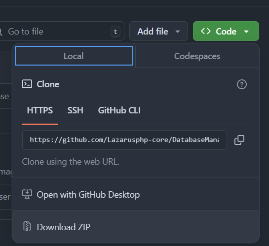

# The Lazarusphp  Database Manager

## What is the Database Manager.
The Database Manager is an Abstract Pdo Database class designed to interact between the website and the server.

## Requirments
* A config file.
* Knowlege of php and the use of composer.

## How to install?
it is recommended to use Composer to install 
this package, using composer will download the required files and all dependencies.
```
composer require lazarusphp/databasemanager
```

alternatively Files can be downloaded using the code dropdown menu

## Instantiating the Database.
Making a connection between to the database can be made by calling the static mathod DbConfig::load();
the load() method makes use of 2 parameters the first one which is required is used to pass the configuration file.

the second is not required but can be used to pass to a custom ConfigWriter, If left empty it will default to use [PhpWriter::class] and will require the config file to be in .php format

```php
use LazarusPhp\DatabaseManager\DbConfig;
DbConfig::load(__DIR__.'/../Configs.php");
```

If the config file used is in an .ini format the
 [IniWriter::class] will need to be caled in the second parameter as seen in the example below.

```php
use LazarusPhp\DatabaseManager\DbConfig;
use LazarusPhp\DatabaseManager\ConfigWriters\IniWriter;
DbConfig::load($pathtoconfigfile,[IniWriter::class]);
```
> All Writer classes must be wrapped in an array inputting as a string or integer will be rejected.

for more information on ConfigWriters click here.

## Using the database Queries.

the database class can make a connection to the database in a restricted mode and non-restricted this is done with how the methods are called.

All restricted methods must use the $this->sql($sql,$params) format in order to pass data.

### Example User class

The user class will be used to display record using the One and All method along with RowCount;
> due to the database being abstract it cannot be called and must be extended
```php
class Users extends Database
{

    public function getUsers()
    {

    }

}
```

#### Fetching data with the One Method

If the need to pull one record from the database is required the One() method can be used to accomplish this and can be done as follows.

```php
class Users extends Database
{

    public function getUsers()
    {
        $this->sql("SELECT * FROM  users WHERE id=:id",[":id"=>1]);
        return $this->one();
    }
}

// instantiate the class and display User with the id of 1
$users = new Users();
$user = $users->getUsers();
$user->id;
```


### Fetching date using the All Method
```php
class Users extends Database
{
    public function getUsers()
    {
       $query = $this->sql("SELECT * FROM users");
        return $this->All();
    }

}

    $users = new Users();
    foreach($users->getUsers() as $user)
    {
        echo $user->username . "<br>";
    }
```

### Counting Rows;


```php
class Users extends Database
{
    public function countUsers($id)
    {
       $query = $this->sql("SELECT * FROM users WHERE id >= :$id");
        return $this->RowCount();
    }

}

    $users = new Users();
    $count = $users->countUsers();
    echo $count;

    if($count > 1)
    {
        echo "More than one user";
    }
```

These three restricted methods can be used together ie One() and RowCount() or All and RowCount(), however by directly calling GenerateQuery the request becomes less restricted and gives more control like in the example below

* restricted methods cannot chain any further commands past there initial fetch() request

```php
class Users extends Database
{

    public function getUsersbyId($id)
    {
        return  GenerateQuery("SELECT * FROM  users WHERE id=:id",[":id"=>$id]);
    }

    public function getAll()
    {
        return  GenerateQuery("SELECT * FROM  users");
    }

      public function deleteUserById($id)
    {
        return GenerateQuery("DELETE FROM  users WHERE id=:id",[":id"=>$id]);
    }

// find the user by id, make sure only one row exists and display username
    $users = new Users();
    $user = $users->getUsers(1);
    // Row Found 
    if($user->rowCount() == 1)
    {
        $user = $user->fetch();
        // Display username
        echo $user->username;
    }

    // Delete a user with id 2;
    $users->deleteUserById(2);#

    // Get All users  and display username

    $users = new Users();

    foreach($users->fetchAll() as $users)
    {
        echo $user->username . "<br>";
    }
}
```